<p align="center">
<a href="#">

</a>
</p>
<h1 align="center">QMTRY: The Interoperability & Analytics Engine</h1>
<h3 align="center">Reduce Errors. Improve Timeliness. Unlock Insight. 🚀</h3>
<p align="center">
<strong>From chaotic HL7/FHIR feeds to audit-ready executive analytics.</strong>
<br />
This is the blueprint for building data systems that government agencies can trust.
<br />
<br />
<a href="https://github.com/your-repo/qmtry/issues">Report Bug</a>
·
<a href="https://github.com/your-repo/qmtry/issues">Request Feature</a>
</p>
<p align="center">


</p>
 
🏛️ To the Honorable Executive: A New Standard for Public Trust
 
In government health and human services, data isn't just data—it's a public commitment. It's the proof behind policy, the safeguard for citizens, and the bedrock of accountability. Yet, fragmented systems, messy data, and black-box analytics create risk, delay critical decisions, and erode that trust.
QMTRY changes the game. We provide an open, auditable, and error-resilient framework to transform your raw data feeds into a strategic asset.
The Bottom Line for Leaders: This isn't just a tool; it's a system for generating defensible decisions. It delivers fewer preventable errors, faster response times, and a crystal-clear, proof-ready trail for auditors, oversight committees, and the public you serve.
 
✨ Why This Works: Interoperability Without the Drama
 
| Feature | Your Advantage |
|---------|----------------|
| 🤝 Interoperability Without Drama | Ingest and harmonize messy HL7v2, FHIR, and claims data. We normalize the chaos so you can focus on the mission. |
| ✅ Quality By Default | Automated data quality gates catch errors before they poison your dashboards and endanger decisions. |
| ⏱️ Speed With Control | Go from raw data to executive insight in hours, not weeks, with CI/CD-driven analytics and immutable evidence. |
| 🎯 Clinically-Relevant Templates | Deploy pre-built models for high-value use cases like Stars/HEDIS, sepsis early warning, and fraud detection. |
 
🎯 Outcomes That Matter (And We Can Prove)
 
We don't just build pipelines; we drive measurable results that align with public sector goals.

* 📉 Fewer Errors at the Point of Care: Closed-loop digital workflows (CPOE + eMAR + barcode) have been proven to drastically reduce medication administration errors, protecting patients and reducing liability.

* 🚑 Faster Treatment, Better Survival: Our real-time sepsis early-warning system cuts time-to-antibiotics, a metric directly linked to material mortality reductions in multi-site studies.

* 🔒 Data You Can Defend: Our formal healthcare data-quality framework and human-readable checks keep "bad data" out of executive decisions, ensuring every report is built on a foundation of truth.
 
🗺️ The Blueprint: From Raw Data to Auditable Insight
 
This isn't a black box. Our reference architecture is transparent, local-first, and cloud-ready. Every step is logged, tested, and ready for inspection.

```mermaid
flowchart LR
  subgraph ingestion ["📥 Ingestion"]
    A1["HL7 v2 Feeds"] -->|Adapter| P["Raw Events"]
    A2["FHIR APIs"] --> P["Raw Events"]
    A3["CSV/SFTP/Claims"] --> P["Raw Events"]
  end

  subgraph quality ["✅ Quality Gates"]
    P["Raw Events"] --> Q1["Automated Checks: Schema, Ranges, Completeness"]
    Q1["Automated Checks: Schema, Ranges, Completeness"] -->|PASS ✅| S["Validated Bronze (Parquet/DuckDB)"]
    Q1["Automated Checks: Schema, Ranges, Completeness"] -->|FAIL ❌| R["Quarantine + Data Docs + Alert"]
  end

  subgraph transformations ["🔄 Transformations"]
    S["Validated Bronze (Parquet/DuckDB)"] --> D1["dbt: Canonical Models (Patients, Encounters, Meds, Labs)"]
    D1["dbt: Canonical Models (Patients, Encounters, Meds, Labs)"] --> G["Gold Marts: Quality, Finance, Operations"]
  end

  subgraph analytics ["📊 Analytics & Actions"]
    G["Gold Marts: Quality, Finance, Operations"] --> BI["Executive Dashboards (HEDIS, KPIs)"]
    G["Gold Marts: Quality, Finance, Operations"] --> RT["Real-time Signals (Sepsis Alert, Bed Monitor)"]
  end

  subgraph evidence ["🧾 Evidence Bundles"]
    Q1["Automated Checks: Schema, Ranges, Completeness"] --> E1["HTML Data Docs"]
    D1["dbt: Canonical Models (Patients, Encounters, Meds, Labs)"] --> E2["Model Lineage + Tests"]
    G["Gold Marts: Quality, Finance, Operations"] --> E3["Signed Evidence Bundle (zip)"]
  end

  classDef node fill:#0b3d3b,color:#fff,stroke:#0fa,stroke-width:1.2px;
  class A1,A2,A3,P,Q1,S,R,D1,G,BI,RT,E1,E2,E3 node;
```



Local-first, cloud-ready. Default storage uses Parquet + DuckDB for a zero-cloud, secure-by-default path. Toggle to your lakehouse/warehouse with a single configuration change.

🔗 Deep Dive: HL7 and FHIR Interoperability with QMTRY

QMTRY excels in handling both HL7 v2 and FHIR standards, bridging legacy systems with modern APIs for seamless data flow.

**HL7 v2 Overview:** HL7 Version 2 is a messaging standard for exchanging clinical and administrative data. Messages are pipe-delimited strings with segments like MSH (Message Header), PID (Patient Identification), and OBX (Observation).

Here's a simplified structure of an HL7 v2 ADT^A01 message:


QMTRY's adapters parse these segments, validate against schemas, and map to canonical models.

**FHIR Overview:** Fast Healthcare Interoperability Resources (FHIR) is a standard for exchanging healthcare information electronically using RESTful APIs and resources like Patient, Encounter, MedicationRequest.

A typical FHIR workflow in QMTRY:


QMTRY ingests FHIR bundles, normalizes resources using terminology services (e.g., SNOMED, LOINC), and integrates with HL7 data for a unified view.
 
🎁 What's In The Box?
 

* ingest/: 🔌 Adapters for HL7 v2 (ADT/ORM/ORU) and FHIR resources.

* transform/: 💎 A full dbt project for conformance, deduplication, and terminology mapping.

* quality/: 🔎 Great Expectations suites that automatically generate browsable Data Docs.

* dashboards/: 📈 Streamlit executive views (dark theme) and Stars/HEDIS tiles.

* playbooks/: 📖 Runbooks for on-call, rollback procedures, and release checklists.

* evidence/: 🗂️ Signed artifacts: test logs, lineage graphs, and data-quality reports for your auditors.

 
📈 Mission-Critical KPIs We Drive (And How We Measure Them)
 
 
Safety & Quality
 

* Medication Administration Error Rate (MAER) ↓

  * MAER = (errors / administrations), monitored per unit/service line.

* Sepsis Time-to-Antibiotics ↓ & In-Hospital Mortality ↓

  * Event timers + outcome tracking by risk cohort.

 
Operations & Finance
 

* Time-to-Insight (TTI) ↓

  * TTI = Data Arrival to Executive Dashboard Publish, enforced via CI/CD SLAs.

* Denial Rate & Avoidable Write-offs ↓

  * Root-cause drilldowns (CARC/RARC), pre-adjudication edits, and automated workqueues.

 
Governance
 

* Data Quality Score (DQS) ↑ across completeness, validity, timeliness, consistency.

  * Thresholds block data promotion until evidence of quality is attached.

 
🚀 See It To Believe It: Run the Demo in 5 Minutes
 
Experience the clarity and control QMTRY provides on your own machine.
```bash
# 1. Set up your environment
python -m venv .venv && source .venv/bin/activate
pip install -r requirements.txt

# 2. Generate demo data & run the pipeline
python scripts/make_demo_data.py        # Creates mock HL7/FHIR fixtures
dbt deps && dbt build --profiles-dir .  # Builds the analytics models

# 3. Validate data quality & generate docs
python scripts/run_gx_checks.py         # Generates ./evidence/data_docs/

# 4. Launch the Executive Command Center!
streamlit run dashboards/executive_home.py
```

🎉 Voilà! You'll see Data Quality Gate results, Stars/HEDIS tiles, CFO-level operational KPIs, and a downloadable Evidence Bundle—exactly what you'd provide to an auditor.
 
🧑‍🍳 Our Secret Sauce: How We Deliver on Our Promises
 
 
How We Reduce Errors (Concretely)
 

* Normalization That Sticks: Vocabulary maps (LOINC, RxNorm, SNOMED) and unit harmonization turn messy source data into a single source of truth.

* Pre-emptive Quality Gates: Failing data is quarantined before it can mislead. Alerts pinpoint what broke, where, and who owns the fix.

* Closed-Loop Safety Patterns: Digital handshakes for CPOE → pharmacy → eMAR + barcode prevent wrong-patient/wrong-dose errors.

* Evidence, Not Anecdotes: Every release is bundled with signed Data Docs, dbt test runs, lineage graphs, and SLA timing proof.

 
How We Improve Timeliness (Without Sacrificing Control)
 

* CI/CD for Analytics: Pull requests automatically run data tests. Merges automatically publish updated dashboards. This is speed and safety.

* Blazing-Fast Local Analytics: Columnar storage (Parquet/DuckDB) accelerates exploration 10–100×, even on a laptop.

* SLA Enforcement: Deployments automatically fail if freshness or quality thresholds aren’t met, guaranteeing timeliness.

 
🛡️ Built for Government-Grade Security & Compliance
 
We designed QMTRY with the rigorous demands of public sector work in mind.

* 🔐 HIPAA Ready: Follows principles of least-privilege access, PHI minimization, and end-to-end encryption for data in transit and at rest.

* ✍️ Ironclad Change Control: Signed artifacts, reproducible builds, and immutable data provide a complete, unchangeable audit trail for every single number.

* 🇺🇸 Data Residency & Control: Local-first by default. For cloud deployments, we provide templates for secure VPC peering and data residency controls to meet all jurisdictional requirements.

 
🗺️ Roadmap: Future-Proofing Your Investment
 

* [Q4 2025] FHIR Subscriptions for near-real-time eventing.

* [Q1 2026] Pluggable terminology service integration (internal or third-party).

* [Q2 2026] Out-of-the-box Stars/HEDIS measure packs with certified logic.

 
🤝 Let's Build a More Accountable Future, Together.
 
Ready to move from data chaos to data confidence? We're here to help.

* 📧 Email Us: contracts@qmtry.com

* 🛠️ Request a Workshop: We offer free workshops on quality improvement, denials reduction, and executive KPI design.

* 💡 Launch a Pilot: Our 30-Day “Insight Sprint” is the perfect low-risk way to see QMTRY in action. We'll connect 2-3 of your data feeds, ship a live dashboard, and deliver your first Evidence Bundle.

 
License
 
This project is licensed under the MIT License - see the LICENSE file for details.
 
📚 Sources for Our Claims
 

1. Barcode/eMAR closed-loop medication workflows reduce administration errors and potential ADEs (AHRQ PSNet summaries of multiple pre/post studies).

2. Real-time sepsis early-warning (TREWS) reduced time-to-antibiotics and was associated with significant mortality reduction in a prospective multi-site study; overview and follow-ups.

3. FHIR as the dominant interoperability standard in current health research and implementations.

4. The critical role of formal healthcare data-quality frameworks (fit-for-purpose), and the value of automated, human-readable tests (e.g., Great Expectations).
